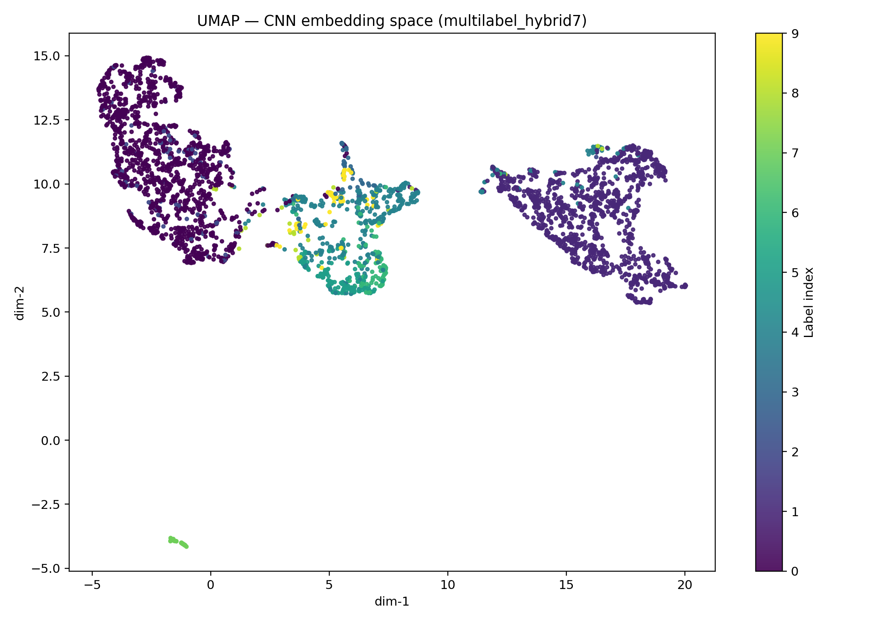

# SRP Dynamogram Classification  
## End-to-End Industrial AI using Hybrid Deep Learning

---

## Overview

This repository presents a **full end-to-end industrial AI solution** for classification and diagnosis of  
**Sucker Rod Pump (SRP) dynamometer cards**, combining:

- **Deep learning (1D CNNs)**
- **Physics-informed, domain-engineered features**
- **Production-oriented inference and decision logic**

The project is **explicitly designed around real operational constraints**, not idealized academic benchmarks.

It demonstrates how machine learning can be made **usable, explainable, and trustworthy** in industrial environments,
where data is noisy, labels are imperfect, and decisions must still be made.

> **This is not just a model — it is a complete diagnostic pipeline, from raw data to production-ready inference.**

---

## Live Demo

🔗 **Interactive Streamlit Demo**  
https://industrial-ai-srp-dynamogram-troubleshooting-xlhcdmwspzgqzc423.streamlit.app/

The demo enables:
- interactive inspection of individual SRP dynamograms,
- side-by-side comparison of trained models,
- **Top-1 and Top-2 predictions**,
- confidence-aware diagnostic behavior.

---

## Industrial Problem Context

SRP dynamograms are a core diagnostic tool in oil production, used to identify:

- gas interference  
- fluid pound  
- mechanical wear  
- valve leakage  
- rod / tubing interaction  
- normal operating regimes  

### Real Field Constraints

In real field operations:

- multiple failure mechanisms may coexist in a single pump cycle,
- operating conditions continuously evolve,
- historical labels are assigned by experts and inevitably contain subjectivity.

As a result, **perfect class separation does not exist in operational data**.

This repository **embraces that reality instead of hiding it**.

---

## Key Design Philosophy

> **Effective industrial ML is not about perfect data —  
> it is about building systems that remain useful despite imperfect data.**

All architectural and modeling decisions in this project follow this principle.

---

## End-to-End Project Flow

The repository implements the complete industrial AI lifecycle:

### 1. Data Ingestion
- SRP dynamograms stored in long/tabular format  
  (`graph_id`, `x`, `y`, `label`)

### 2. Signal Preprocessing
- graph-level grouping (no data leakage)
- resampling to fixed resolution
- normalization for shape robustness

### 3. Feature Engineering (Domain-Driven)
- physically meaningful shape descriptors
- symmetry and fill-factor metrics
- statistical moments
- shape complexity indicators

### 4. Model Training
- CNN-only (signal-based baseline)
- Hybrid CNN + engineered features
- single-label and multi-label objectives
- class-weighted loss
- reproducible splits

### 5. Inference & Decision Logic
- Top-1 and **Top-2 predictions**
- ambiguity-aware interpretation
- confidence-aware diagnostics

### 6. Visualization & Validation
- Streamlit expert review UI
- curve inspection
- probability-ranked outputs
- **embedding-space analysis (UMAP / t-SNE)**

This structure mirrors how **industrial AI systems are actually built, validated, and trusted**.

---

## Model Architectures

### 1) CNN (Signal-Only Baseline)

- 1D CNN trained directly on normalized dynamogram curves
- Learns pure shape representations
- Strong on dominant operating regimes
- Limited robustness in overlapping failure modes

---

### 2) Hybrid CNN + Engineered Features

CNN shape encoder combined with physics-informed features.

Two variants are implemented:

- **Hybrid-7**: compact, robust, production-friendly  
- **Hybrid-17**: extended, higher expressiveness  

**Benefits:**
- improved stability on imbalanced data,
- better interpretability,
- improved ambiguity handling.

---

## Single-Label vs Multi-Label Hybrid Models

### Single-Label (Softmax)

- Assumes one dominant failure mode per pump cycle
- Outputs normalized class probabilities
- Clear ranking and simpler interpretation
- Well-suited for production decision support

### Multi-Label (Sigmoid)

- Allows multiple simultaneous failure mechanisms
- Outputs independent probabilities per class
- Better reflects physical reality in mixed regimes

**Key observation:**

Both approaches achieve **similar aggregate metrics**, but:

- multi-label models produce **smoother, more continuous embedding spaces**,
- transitional regimes are represented more naturally,
- single-label models offer **clearer Top-2 decision behavior**.

---

## Tabular (Feature-Only) Models — Baseline Analysis

Classical ML models trained **only on engineered features**, without access to raw signal shape:

- Logistic Regression
- Random Forest
- Extra Trees
- Histogram Gradient Boosting

### Purpose

Tabular models are included to:

- establish a lower-bound baseline,
- isolate the value of raw signal shape,
- validate that hybrid gains are structural, not cosmetic.

### Observed Behavior

Tabular models consistently show:

- lower accuracy and macro-F1,
- weak separation of overlapping regimes,
- unstable Top-2 rankings,
- poor robustness on transitional samples.

### Engineering Conclusion

Tabular models serve as **diagnostic baselines only** and are **not suitable for production SRP diagnostics**.

This confirms that **SRP diagnosis cannot be reduced to static feature vectors alone**.

---

## Embedding Space Analysis (UMAP / t-SNE)

To validate representation quality beyond metrics, CNN embedding vectors are visualized using **UMAP and t-SNE**.

### Observations

- single-label hybrids form **compact but rigid clusters**
- multi-label hybrids produce **continuous manifolds**
- transitional regimes occupy intermediate embedding regions
- rare failure modes remain separable but closer to dominant regimes

This confirms that the models learn **physically meaningful latent representations**, not artificial class boundaries.

**Embedding continuity directly supports Top-2 decision regimes in production.**

---

## Inference Strategy (Production-Critical)

A key insight from this work:

> **Top-2 predictions are often more valuable than Top-1 predictions in SRP diagnostics.**

### Why Top-2 Matters

- real failures overlap physically,
- forcing a single class hides uncertainty,
- engineers reason comparatively, not categorically.

The system is therefore designed to:

- always surface Top-2 hypotheses,
- expose confidence gaps,
- support expert judgment instead of replacing it.

---

## Final Metric Comparison (Representative)

| Model | Input | Accuracy | Macro-F1 | Production Suitability |
|------|------|----------|----------|------------------------|
| Tabular | Features only | ~0.70 | ~0.60 | ❌ No |
| CNN | Signal only | ~0.77 | ~0.65 | ⚠️ Limited |
| Hybrid-7 (single) | Signal + features | ~0.83 | ~0.66 | ✅ Yes |
| Hybrid-17 (single) | Signal + features | ~0.81 | ~0.74 | ✅ Yes |
| Hybrid-7 (multi) | Signal + features | ~0.82 | ~0.68 | ✅ Yes |

---

## Final Production Model Choice

**Selected production model:**  
**Hybrid-7 (single-label) with Top-2 inference**

### Justification

- best balance between accuracy, robustness, and interpretability,
- stable Top-2 behavior across ambiguous regimes,
- lower complexity than Hybrid-17 with comparable diagnostic quality,
- clearer decision surfaces for engineers,
- easier operational deployment and maintenance.

Multi-label models remain highly valuable for:
- exploratory analysis,
- embedding inspection,
- future hierarchical or expert-in-the-loop extensions.

---

## What This Project Demonstrates

This repository demonstrates the ability to:

- deeply understand SRP physics and diagnostics,
- design ML systems around real operational constraints,
- integrate domain knowledge into neural architectures,
- build complete end-to-end AI pipelines,
- communicate limitations transparently and responsibly.

> **This is the difference between academic ML and industrial AI.**

---

## Future Production-Oriented Extensions

- decision thresholds and abstention logic
- hierarchical diagnostics
- expert-in-the-loop feedback
- real-time well monitoring integration
- deployment as a diagnostic microservice

---

## Author

**Bojan Martinović**  
PhD – Petroleum Engineering  

**Focus:**  
Production Engineering · Artificial Lift · Industrial AI · Digital Oilfield

Developed by an oil & gas production technology professional with extensive experience in SRP diagnostics,
field operations, and applied machine learning.

---

## Disclaimer

All modeling concepts, feature definitions, and system-level design choices in this repository are the
original work of **Bojan Martinović**.

---

## What Is Intentionally Not Included

- proprietary SRP datasets  
- labeled production field data  
- trained production model weights  
- train/validation/test split identifiers  

### Rationale

Industrial SRP data is subject to confidentiality and IP constraints.

All methodology, code, and pipelines are fully provided and reproducible on compliant datasets,
which reflects standard **industrial AI practice**.

> Internal benchmarking tools and training pipelines are intentionally excluded
> to protect proprietary workflows and intellectual property.

